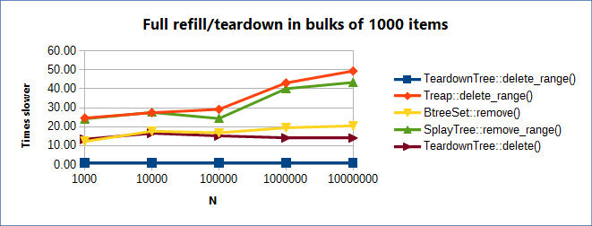

=============
teardown_tree
=============

`API docs <https://docs.rs/teardown_tree/>`_

|crates|_ |travis|_

.. |crates| image:: http://meritbadge.herokuapp.com/teardown_tree
.. _crates: https://crates.io/crates/teardown_tree

.. |travis| image:: https://travis-ci.org/kirillkh/rs_teardown_tree.svg?branch=master
.. _travis: https://travis-ci.org/kirillkh/rs_teardown_tree

A BST (binary search tree) written in Rust that supports efficient query and **teardown** scenarios, i.e. the typical usage
pattern is to build a master copy of the tree, then

1. **clone** the master copy to a new tree
2. tear the tree down with a series of **delete-range** operations (and do something with the retrieved items), interspersed with range queries
3. rinse, repeat

Two variations are currently implemented: **TeardownTree** and **IntervalTeardownTree** (an |IntervalTree|_).

The tree does not use any kind of self-balancing and does not support insert operation.

.. |IntervalTree| replace:: augmented Interval Tree
.. _IntervalTree:  https://en.wikipedia.org/wiki/Interval_tree#Augmented_tree

-------
Details
-------

The tree is implicit -- meaning that nodes do not store explicit pointers to their children. The only thing we store in
a node is your data. This is similar to how binary heaps work: all nodes in the tree reside in an array, the root always
at index 0, and given a node with index i, its left/right children are found at indices ``2*i+1`` and ``2*i+2``. Thus no
dynamic memory allocation or deallocation is required. This makes it possible to implement a fast **clone** operation:
instead of traversing the tree, allocating and copying each node individually, we are able to allocate the whole array
in a single call and efficiently copy the entire content. The tree also supports a **refill** operation (currently
only implemented for T: Copy), which copies the contents of the master tree into ``self`` without allocating at all.

As to **delete-range** operation, we use a custom algorithm running in ``O(k + log n)`` time, where k is the number of
items deleted (and returned) and n is the initial size of the tree. `Detailed description <delete_range.md>`_.
 
An exhaustive automated test for **delete-range** has been written and is found in ``lib.rs``. I have tested all trees
up to the size n=10. All the other supported operations have been tested extensively for every variation of the tree (we
use slightly different algorithms for IntervalTree and for the filtered variants). In general, I feel the quality is
already pretty good. If you find any bugs, please open an issue.

The library has been optimized for speed based on profiling. A significant amount of unsafe code is employed. Every
occurrence of unsafe code has been carefully reviewed, most have been annotated with comments elaborating on safety.

-----
Usage
-----

As a library
------------
| Add to your Cargo.toml:
|
|     ``[dependencies]``
|     ``teardown_tree = "0.6.4"``
|

| And to your crate's root:
|
|     ``extern crate teardown_tree;``

To run the benchmarks
---------------------
1. Install Rust and Cargo (any recent version will do, stable or nightly).
2. ``git clone https://github.com/kirillkh/rs_teardown_tree.git``
3. ``cd rs_teardown_tree/benchmarks``
4. ``cargo run --release``

----------
Benchmarks
----------

I have performed a set of benchmarks, comparing ``TeardownTree::delete_range()`` against

1. ``IntervalTeardownTree::delete_range()``, an Interval Tree based on TeardownTree (using (x,x) points in place of intervals)
2. ``BTreeSet::remove()`` in Rust's standard library
3. |treap|_
4. |splay|_
5. ``TeardownTree::delete()``, which deletes a single element

.. |treap| replace:: ``Treap``
.. _treap: https://github.com/kirillkh/treap-rs

.. |splay| replace:: ``SplayTree``
.. _splay: https://github.com/kirillkh/splay-rs

I made straightforward modifications to ``Treap`` and ``SplayTree`` in order to add support for **delete_range**, however
``BTreeSet`` lacks an equivalent operation (it has an ``O(log n)`` ``split``, but not ``merge``, see
`Rust #34666 <https://github.com/rust-lang/rust/issues/34666>`_), therefore ``BTreeSet::remove()`` is used instead.

As the graph above shows, on my machine the whole refill/teardown sequence on a tree of 1,000,000 u64 items (we refill the
tree with elements from the master copy, then delete 1000 items at a time until the tree is empty), is ~20 times faster
with ``TeardownTree::delete_range()`` than with ``BTreeSet::remove()``. It also uses 45% less memory.

|Benchmarks|_

.. |Benchmarks| replace:: **All benchmarks**
.. _Benchmarks:  benchmarks/benchmarks.md
